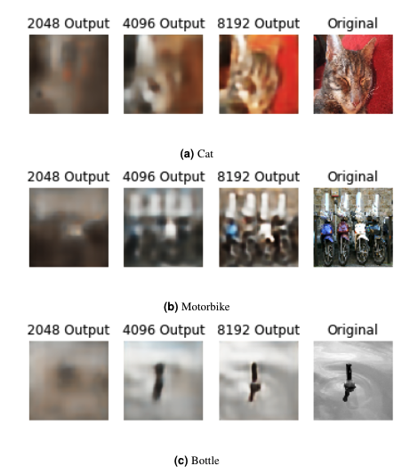
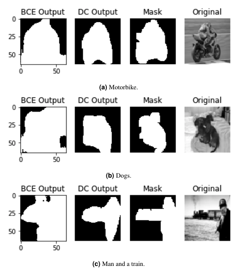

# In The Name Of Deep Learning

In this project, we analyze the value of Convolutional Neural Networks for two topics in image processing: feature extraction and image segmentation. The data used in this project is a subset of a well-known dataset, PASCAL VOC-20091, which has been used to train different architectures of neural networks as a benchmarking dataset. 

In the feature extraction section, we have tested different autoencoder settings with several coding variables such as 2048, 4096 and 8192 achieving a Mean Squared Error of the reconstruction of 0.01.

In the segmentation section, we obtained a promising pixel-wise classifier with a Dice coefficient value of 0.68. The image below shows the segmented image using Binary Cross-Entropy as the loss function (left), the segmented image using Dice Coefficient as the loss function (center-left), the target binary mask with the foreground in white and the background in black (center-right) and the original image (right).

